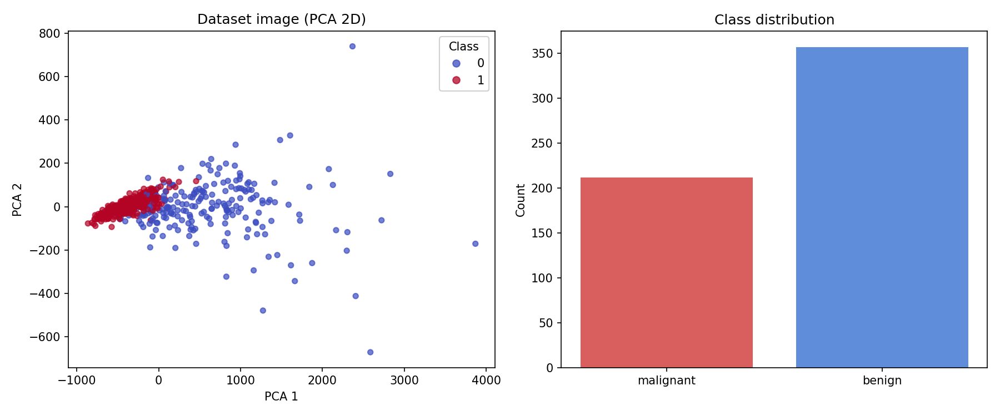
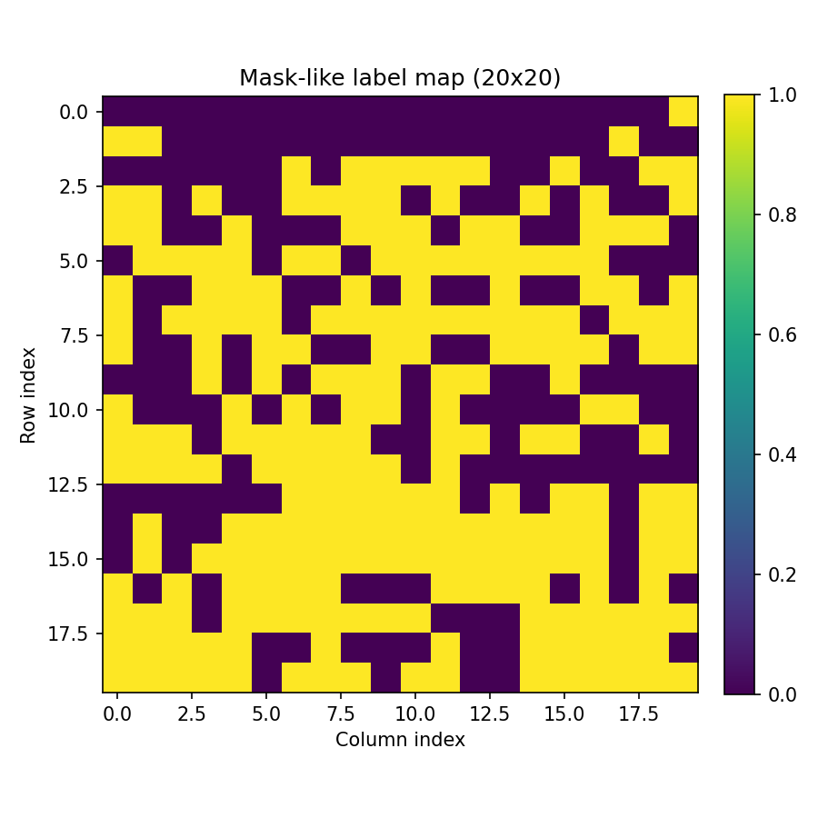
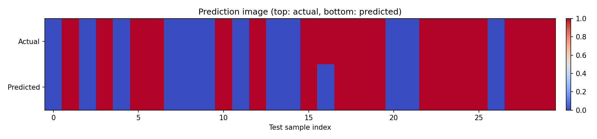
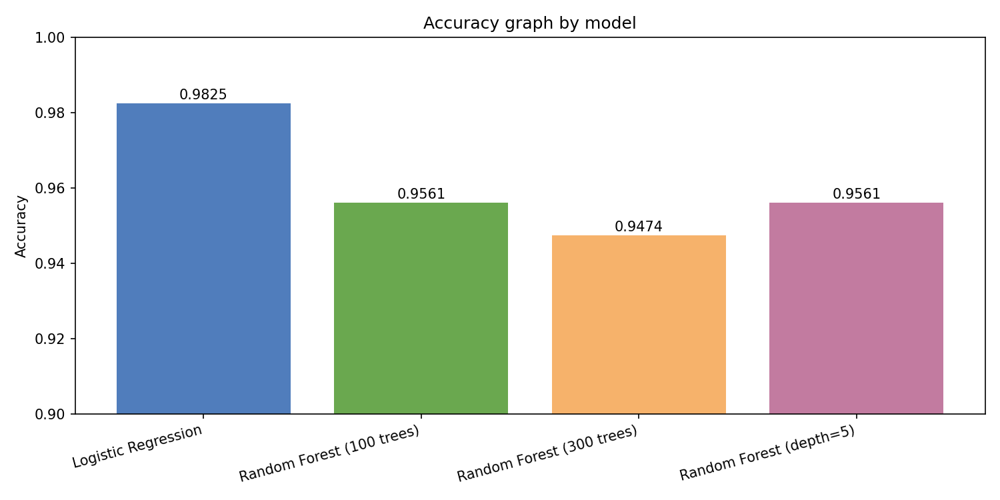
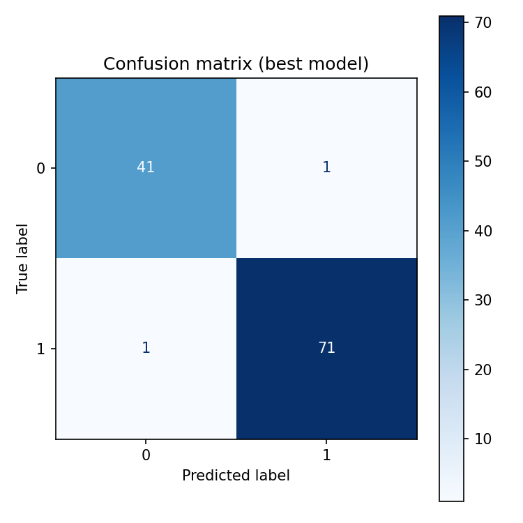
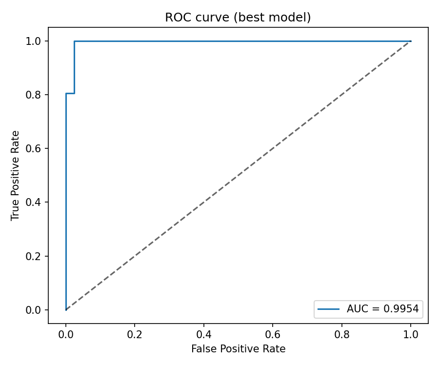

# 프로젝트 결과 보고서

## 1. 과제 개요

- 과제 주제: 머신러닝 분류 모델 구현 및 GitHub 기반 OSS 개발 흐름 실습
- 사용 데이터셋: `sklearn.datasets.load_breast_cancer`
- 구현 언어/라이브러리: Python, scikit-learn, matplotlib

## 2. 사용 데이터셋

- 데이터셋 이름: load_breast_cancer
- 전체 샘플 수: 569
- 특성(feature) 수: 30
- 클래스:
  - malignant: 212
  - benign: 357
- 분할 비율: train 80% / test 20%
  - train: 455
  - test: 114

## 3. 모델 및 학습 설정

비교한 모델은 아래와 같습니다.

1. Logistic Regression (표준화 + 로지스틱 회귀)
2. Random Forest (100 trees)
3. Random Forest (300 trees)
4. Random Forest (depth=5)

공통 설정:

- `train_test_split(..., test_size=0.2, random_state=42, stratify=y)`
- 동일한 train/test 데이터에서 모델별 성능 비교

## 4. 학습 결과 및 정확도

| 모델 | Accuracy | Precision (macro) | Recall (macro) | F1 (macro) |
|---|---:|---:|---:|---:|
| Logistic Regression | 0.982456 | 0.981151 | 0.981151 | 0.981151 |
| Random Forest (100 trees) | 0.956140 | 0.955062 | 0.950397 | 0.952638 |
| Random Forest (300 trees) | 0.947368 | 0.943452 | 0.943452 | 0.943452 |
| Random Forest (depth=5) | 0.956140 | 0.955062 | 0.950397 | 0.952638 |

최종 최고 성능 모델:

- Best Model: Logistic Regression
- Accuracy: 0.982456
- ROC-AUC: 0.995370

## 5. 시각화 결과

### 5.1 데이터셋 이미지

아래 이미지는 PCA 2차원 투영 + 클래스 분포를 함께 보여줍니다.



### 5.2 마스크 이미지

해당 데이터셋은 영상 분할(segmentation) 데이터가 아니므로 실제 마스크는 존재하지 않습니다.
대신 클래스 라벨을 2차원 맵으로 재배치한 마스크 형태 시각화를 추가했습니다.



### 5.3 예측 이미지

테스트 샘플 일부(상위 30개)에 대해 실제값과 예측값을 이미지 형태로 비교했습니다.



### 5.4 정확도 그래프

모델별 정확도를 막대그래프로 비교했습니다.



### 5.5 추가 평가 이미지

- Confusion Matrix



- ROC Curve



## 6. 결론

- load_breast_cancer 데이터셋에서 Logistic Regression이 가장 높은 정확도를 보였습니다.
- 단순히 트리 수를 늘린 Random Forest(300 trees)가 항상 성능 향상을 보장하지는 않았습니다.
- 분류 문제에서는 정확도뿐 아니라 Confusion Matrix, ROC-AUC 같은 지표를 함께 확인하는 것이 중요합니다.

## 7. 재현 방법

1. 의존성 설치

```powershell
& ".venv/Scripts/python.exe" -m pip install -r requirements.txt
& ".venv/Scripts/python.exe" -m pip install matplotlib
```

2. 학습 스크립트 실행

```powershell
& ".venv/Scripts/python.exe" breast_cancer_classifier.py
```

3. 보고서 자산(이미지/지표) 생성

```powershell
& ".venv/Scripts/python.exe" generate_report_assets.py
```